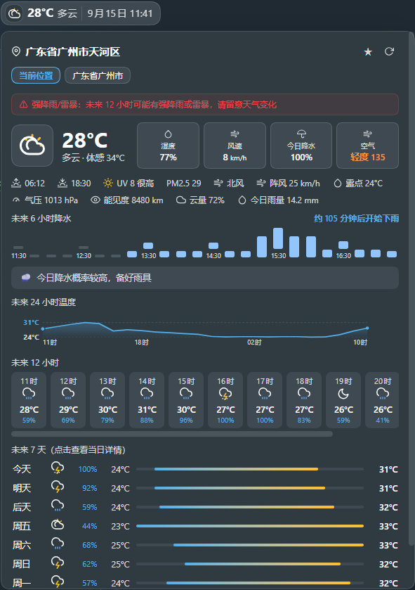

# dsh-weather

DSH Web 会话顶栏的天气插件：**当前天气 + 实时日期时间 + 未来 12 小时/7 天预报**。
装上后，打开 DeepSeek Harness 网页版进入任一会话，即可在会话顶部操作行看到天气 chip——它内嵌在 app 布局里，不与任何浮层插件抢位置。

- 数据来自 [Open-Meteo](https://open-meteo.com/)：免费、无需 API key、浏览器直连
- 自动定位优先使用浏览器定位（GPS/WiFi，可精确到区），失败或拒绝时回退 IP 定位
- **不收集、不上传任何个人数据**，配置仅保存在本地



## 安装

**方式一：插件市场一键安装（推荐）**

1. 如果还没有插件市场，先安装它：

   ```sh
   dsh plugin --profile web add dshmarket
   ```

2. 重启 `dsh web`，打开 **设置 → 插件市场**，搜索 **weather**，一键安装 `dsh-weather`。
3. 刷新页面，进入会话即可在顶部操作行看到天气 chip。

**方式二：命令行从 GitHub 安装**

```sh
dsh plugin --profile web add https://github.com/QianLuo-Ly/dsh-weather
```

重启（或按提示刷新）`dsh web` 后生效。

> 要求 dsh web 0.1.0-rc.6 或更新版本。

## 使用

- **天气 chip**：常驻在会话顶部操作行，单行紧凑显示天气图标、温度、具体天气与**日期时间**（分钟级自动刷新，如 `⛅ 26° 晴 · 7月5日 14:05`），点击展开详情；展开/收起都看得到时间。
- **详情弹层**：
  - **当前天气**：大图标 + 大温度，以及湿度 / 风速 / 阵风 / 风向 / 气压 / 能见度 / 云量 / 露点 / 今日降水量 / 空气质量（AQI + PM2.5）
  - **今日信息**：日出 / 日落 / 紫外线指数 / PM2.5 + 一句话出行建议（带伞 / 防晒 / 防暑等）
  - **未来 6 小时降水**：15 分钟级降水柱状条（Open-Meteo `minutely_15`），直接告诉你「预计几点开始下雨 / 会下多久」
  - **未来 24 小时**温度趋势曲线
  - **未来 12 小时**逐小时预报、**未来 7 天**预报（带温度区间渐变条）
- **即将下雨提示**：预计 2 小时内开始下雨时，详情弹层的降水区会显示「☔ 约 X 分钟后有雨」；启用浏览器提醒后也会提前通知带伞。
- **浏览器标签页标题**会同步显示当前天气，刷新也保持同步。
- **恶劣天气提醒**：当前或**未来 12 小时预报**出现强降雨 / 雷暴 / 高温 / 大风 / 强降雪时发送浏览器通知（可在设置中开关）；1 小时内即将下雨也会提醒带伞。
- **失败降级**：刷新失败时保留上次成功的数据并标注快照时间，不会突然空白。
- **⚙ 设置**：点击天气 chip 展开弹层可切换单位 / 重新定位；完整配置在 **设置（左下角齿轮）→ 天气**：
  - 显示开关
  - 定位方式：`自动`（GPS 优先，失败回退 IP）或 `手动`（中文城市搜索，如「北京」「上海」，或直接填经纬度）
  - 单位：摄氏 °C / 华氏 °F
  - 自动刷新间隔（默认 15 分钟）
  - 恶劣天气提醒开关

## 常见问题

- **定位不够精确？** 天气 chip → 弹层「📍 重新定位」，或 **设置 → 天气 → 定位方式**改为 `手动`，搜索城市或直接填经纬度。
- **想用华氏度？** ⚙ 设置 → 单位切换为 °F。
- **天气数据准吗？** 数据来自 Open-Meteo（免费公共气象服务），每小时自动更新；也可以点 ⚙ 设置调短自动刷新间隔。

## 数据来源与隐私

| 用途 | 服务 | 说明 |
|---|---|---|
| 天气数据 | Open-Meteo | 免费公共 API，浏览器直连 |
| 自动定位 | 浏览器定位 / geojs.io | GPS 优先，失败回退 IP 定位（仅市一级） |
| 中文区名 | BigDataCloud | 反向地理编码 |

插件**不收集、不上传任何用户数据**；所有配置仅保存在 DSH 本地设置中。

## 开发者

构建、调试与二次开发说明见 [docs/DEVELOPMENT.md](https://github.com/QianLuo-Ly/dsh-weather/blob/main/docs/DEVELOPMENT.md)。

## License

MIT
